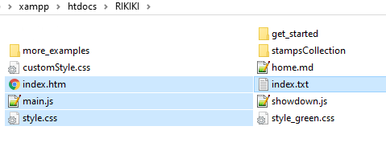

# Installation

# Files to copy in the root directory of your site

You can download a zipped example to get started :  

- [rikiki.zip](get_started/rikiki.zip "32 Kb with showdown lib inside") --> Example and get started help. 
- [Github](https://github.com/SPujolle/RIKIKI "Sources on Github") --> Github repository

If you download the "example and get started" zipped version, you will get 7 files and several directories.

There is four basic files (highlighted in blue) and one optional.

  
  
Basics files :
- index.htm : the home page of your site, contains more or less nothing but a call to javascript function to fill the page
- index.txt : the most important file , store the navigation structure for your site. this file is read when the user call the home page and indicate how to create all navigation bars and menus.
- main.js : the javascript file which generate menus and navigation bars
- style.css : the style sheet, edit it to personalize your site (colors, fonts...)
- showdown.js (optional) : *a bad idea* to have this in your own site unless you need to use it offline (see below)

All others files are for website contents.

- customStyle.css (optional) : user defined styles for contents
- styleGreen.css (optional) : an alternate sytlesheet with differents colors
- home.md : the content of your home page, could be here or anywhere under the root of your site. It could be a good idea to make a folder for the home page.
- other folders : contents of your page. You dont need to creat folder, but it will help you to build a clean site.

## weird idea : showdown.js local copy
It's a library [http://showdownjs.com/](http://showdownjs.com/) used to parse markdown syntax to display it in a browser. 

The best place to have this lib is on the cloud, not your server.
To use online lib you call it on a server like cloudflare with the line :  
``  

This line is already in the "index.htm" file, you just need to decomment it and comment the other showdown.js source on the following line. And so you can remove the "showdown.js" file on your server.  

The only reason why it should be good to have a copy of "showdown.js" on your server, is you intend to work offline or with a very bad connection.
 
 To go to a "production" site avoid to serve "showdown.js" with your site, unless it's the best way for users to access to it (local networks with no access to internet).

