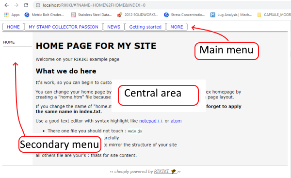

# First view of your site

After copy of files on your server you can wiew your site in any javascript compatible browser.

You can see the three areas :
- Main menu 
- Left column : where contextual links will appear
- Central area : where the content of your page will be displayed.

All you can see is examples text because you did'nt  made any file for pages.  
Some menu items don't have any file associated, so you will see **"problem loading file " Path/name-of-the-missing-file" : server returned status = 404"**, if you call them.

The main menu is filled with an example, you can change all tags in this menu by editing the "index.txt" file
# index.txt syntax

The index.txt file store the structure of your website and navigation map.   
RIKIKI is intended to make simple arborescent site with 2 levels :
**********************
	SITE ROOT
		|--- Home page
		|		|----home page content
		|       |----Second (optional) page content for home page
		|
		|--- TOPIC 1
		|   	|----First TOPIC 1 page
		|      	|----second TOPIC 1 page 
		|		|----third ...
		|
		|--- TOPIC 2
		|   	|----First TOPIC 2 page
		|      	|----second TOPIC 2 page 
		|		|----third ...

*********************
## Example
This is the file which create your menu.  
##Basics rules
- Comment : a line begining with # is a comment
- There is 3 fields by line, separted by comma. The third field can be omited. 
- the begining of the line must be at the first caracter, dont add whitespace
- text must enclosed by double quote (")
- don't use comma in fields. Comma are reserved for fields separators.

************************

	#example 

	"HOME", home.md,

	"MY STAMP COLLECTOR PASSION",stampsCollection/firstPage.htm,
	|"Stamps from Nigeria",stampsCollection/Nigeria.htm,"Nigerian stamps"

	"NEWS", news_folder/page.md,
	|"Last news",news_folder/chap1.htm,
	|"Older news",news_folder/chap2.htm,
	#|"very old ones",news/chap3.md,

	"Getting started", get_started,"A tiny tool to make internet site."

	"MORE",more_examples,"To go farther"

	#"ABOUT", about.htm,
	
*************************

## basic syntax
- Each line describe a menu item
- Each line have 3 fields : the text to display in the link and the file target of the link
- If a line begin with a '|', the menu item wont be displayed in the main menu but in the contextual menu, in the left column
- Line begining directly by a text will be displayed in the main menu.  

### Fields meaning
<table>
<tr>
<th> Field 1</th><th> Field 2</th><th> Field 3</th>
</tr>
<tr>
<td> Text to display in menu </td><td>address of file to display</td><td>tooltip, small description which will  be displayed as infobulle</td>
</tr>
</table>

### File address

All paths are relative to to site root, ie , the place where `main.js` and `index.htm` are.

### Home page
the "home page" is not special : his name dont matter, it will be displayed the same way as normal page. The ONLY special thing with home page is that when you visit the site the first time, it's the page displayed by default.   

The line for the home page is the first (readable) line in "index.txt"